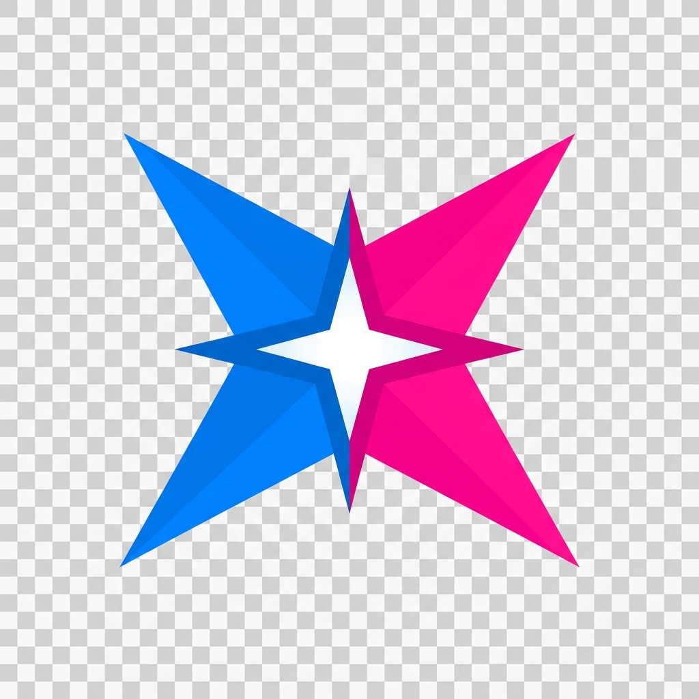

<div align="center">
  
  <h1>LightCrush</h1>
  <p><b>Ultra-lightweight, lightning-fast, and entirely offline image compressor.</b></p>
  
  [](https://opensource.org/licenses/MIT)
  [](#-one-click-downloads)
  [](https://neutralino.js.org/)
</div>

<br/>

LightCrush is a modern desktop application that allows you to compress and convert images (JPG, PNG, WebP) natively on your machine without any cloud uploads. By leveraging **Neutralinojs** instead of Electron, the entire standalone application is **under 2 MB** in size while still delivering a stunning, hardware-accelerated React interface.

---

## ⚡ One-Click Downloads (Latest Release)

No installation required. Just download the single file for your operating system and run it!

| Operating System | Download Link | File Size |
|------------------|---------------|-----------|
| **Windows (64-bit)** | [⬇️ Download `lightcrush-win_x64.exe`](https://github.com/hasnainkhatri87/LightCrush/releases/latest/download/lightcrush-win_x64.exe) | ~ 1.9 MB |
| **macOS (Universal)** | [⬇️ Download `lightcrush-mac_universal`](https://github.com/hasnainkhatri87/LightCrush/releases/latest/download/lightcrush-mac_universal) | ~ 2.1 MB |
| **Linux (64-bit)** | [⬇️ Download `lightcrush-linux_x64`](https://github.com/hasnainkhatri87/LightCrush/releases/latest/download/lightcrush-linux_x64) | ~ 2.0 MB |

> **Note for macOS/Linux users:** After downloading, you may need to make the file executable by running `chmod +x lightcrush-mac_universal` in your terminal before double-clicking it.

---

## ✨ Features

- 🔒 **100% Offline & Private:** Your images never leave your computer. Processing happens entirely locally.
- 🪶 **Impossibly Lightweight:** The entire application is a single executable under 2MB. No bloated installers.
- 🎨 **Modern UI:** Features a sleek, glassmorphic dark-mode interface with beautiful gradients and micro-animations.
- 🔄 **Multi-Format:** Convert seamlessly between `.jpg`, `.png`, and `.webp`.
- 🎚️ **Interactive Preview:** Slide to compare the original vs. compressed image in real-time.
- 🗂️ **Batch Processing:** Drop multiple images at once and compress them all locally.

---

## 🛠️ Development

If you want to compile LightCrush yourself or contribute to the project, the setup is extremely simple.

### Prerequisites
- [Node.js](https://nodejs.org/) (v18+)

### Setup
```bash
# Clone the repository
git clone https://github.com/hasnainkhatri87/LightCrush.git
cd LightCrush

# Install dependencies
npm install
```

### Running Locally
```bash
# Start the Vite development server (Web Mode)
npm run dev
```

### Building the Native Executables
To build the 100% standalone, single-file desktop binaries for all operating systems (Windows, Mac, Linux), run:
```bash
npm run build:desktop
```
This command automatically:
1. Compiles the React/Vite frontend.
2. Uses the Neutralinojs packager to create the native binaries.
3. Automatically embeds (`--embed-resources`) the web assets natively into the executables.

The compiled standalone executables will be generated in the `dist/lightcrush/` folder.

---

## 📄 License

This project is licensed under the MIT License - see the [LICENSE](LICENSE) file for details.
